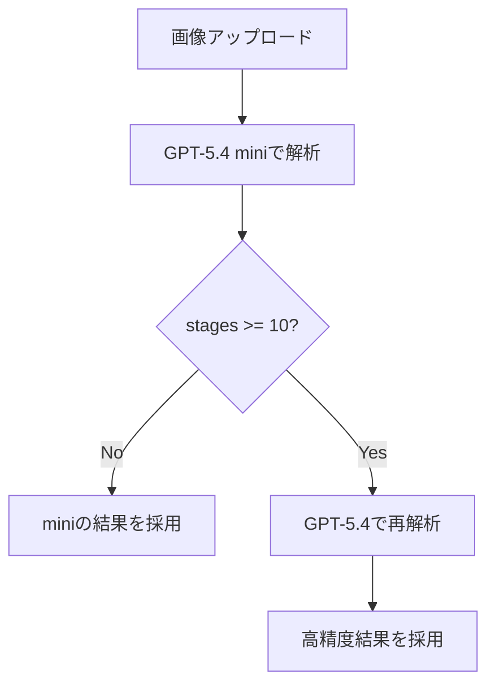

音楽フェス向けタイムテーブル作成サービス「みんなのタイムテーブル」に、画像からタイムテーブルを自動生成する機能を実装しました。しかし、この機能は、LLMを使うため、精度・コスト・速度のバランスに課題がありました。

特に問題になったのが、ステージ数が多い画像の場合は精度が低下するという問題でした。

この記事では、その課題と解決方法として採用した「GPT-5.4 miniとGPT-5.4の動的切り替え設計」について紹介します。

:::message
みんなのタイムテーブルについて詳しくはこちら↓
@[card](https://zenn.dev/yyoshidaweb/articles/299b6dbb16a067)
:::

## 完成した機能

@[tweet](https://x.com/yyoshidaweb/status/2048716956048773177?s=20)

---

## ステージ数が多いと精度が下がる問題

画像からタイムテーブルを生成する際、以下のような構造を持つデータを抽出しています。

* ステージ名（横軸）
* 出演者名
* 開始時刻

テストには以下2つのフェスのタイムテーブル画像を使用しました。

* ARABAKI ROCK FEST.26（6ステージ）
* 下北沢にて'２５（24ステージ）

初期実装では、軽量モデルであるGPT-5.4 miniを使用していました。ステージ数が6のタイムテーブルでは問題なく動作していたのですが、ステージ数が24のタイムテーブルでは「別ステージの出演者が混ざる」という問題が発生しました。

一方で、単純に常に高精度モデル（GPT-5.4）を使うと、コストが高く、速度が遅いという問題がありました。

## 2段階モデル構成を実装

この問題を解決するために採用したのが「2段階モデル構成」です。

以下2つのモデルを併用し、「最初から分岐させる」のではなく、「まずminiで解析し、その結果に応じて再実行する」という構造にしました。

* GPT-5.4 mini：高速・低コスト
* GPT-5.4：高精度・高コスト

### 処理フロー図

ステージ数によって以下のように処理フローが分岐します。



### 1. GPT-5.4 miniで画像解析（必ず1回実行）

まず、すべての画像に対して、GPT-5.4 miniで画像解析します。この段階では精度よりも速度とコスト削減を優先しています。

出力はJSON形式で、以下のような構造になります。

これは、AIによる出力を再現したテストデータで、結合テストで使用しています。

```json:test/fixtures/files/timetable_json.json
{
  "stages": [
    {
      "stage_name": "Stage1",
      "performances": [
        {
          "performer_name": "Performer1",
          "start_time": "10:00"
        },
        {
          "performer_name": "Performer2",
          "start_time": "11:00"
        }
      ]
    },
    {
      "stage_name": "Stage2",
      "performances": [
        {
          "performer_name": "Performer3",
          "start_time": "12:00"
        }
      ]
    }
  ]
}
```

### 2. ステージ数をチェック

次に、生成されたJSONの`stages`の数を確認します。

ステージ数によって以下のように次の処理が分岐します。

- stages < 10 → そのまま採用
- stages ≥ 10 → 再解析へ

ステージ数は有名な音楽フェスを中心に調べたところほとんど10ステージ未満だったため、10という閾値に決めました。


### 3. GPT-5.4で再解析（必要な場合のみ）

ステージ数が10以上の場合のみ、同じ画像を使ってGPT-5.4で再解析を行います。

これによって、ステージ境界の誤認識と、別ステージの出演者が混ざるという問題を防ぎます。

:::message
GPT-5.4 miniがステージ数を誤認した場合は精度が下がってしまうという問題が残っていますが、miniでも大幅にステージ数を誤認する可能性は低いと判断し、現状は許容範囲としています。

例：24ステージの画像でminiが8ステージと返す → 再解析されない → 低精度のままになる
:::

## 実装

画像解析はサービスクラスで行い、再解析時も同じプロンプトが使われます。

```ruby:app/services/timetable_extractor.rb
class TimetableExtractor
  # 画像からタイムテーブルを抽出するクラスメソッド
  def self.extract(tempfile)
    client = OpenaiClient.client
    # 画像をBase64エンコード
    image_base64 = Base64.strict_encode64(File.binread(tempfile))
    # 画像をURL形式に変換
    data_url = "data:image/jpeg;base64,#{image_base64}"
    response = client.responses.create(
      model: "gpt-5.4-mini",
      prompt: {
        id: Rails.application.credentials.dig(:openai, :timetable_extractor_prompt_id)
      },
      input: [
        {
          role: "user",
          content: [
            {
              type: "input_image",
              image_url: data_url
            }
          ]
        }
      ]
    )
    json = JSON.parse(response.output_text)
    stages = json["stages"] || []
    # ステージ数が10以上の場合、高度なモデルで再度解析する
    if stages.size >= 10
      response = client.responses.create(
        model: "gpt-5.4",
        prompt: {
          id: Rails.application.credentials.dig(:openai, :timetable_extractor_prompt_id)
        },
        input: [
          {
            role: "user",
            content: [
              {
                type: "input_image",
                image_url: data_url
              }
            ]
          }
        ]
      )
      json = JSON.parse(response.output_text)
    end
    { success: true, data: json }
  rescue JSON::ParserError => e
    Rails.logger.error("JSON parse error: #{e.message}")
    Rails.logger.error("AI output: #{response&.output_text}")
    { success: false, error: "画像解析結果の読み込みに失敗しました" }
  rescue StandardError => e
    Rails.logger.error(e)
    { success: false, error: "画像解析に失敗しました" }
  end
end
```

## なぜステージ数だけではなくJSON全体を出力させるのか

当初はGPT-5.4 miniのプロンプトだけで「ステージ数が10未満ならステージ数のみ、10以上ならJSONを出力する」といった制御を実現することも検討しました。しかし、出力形式が条件によって変化するとパース処理が複雑になり、想定外の出力による不具合のリスクも高まります。

そのため、常に同じJSONスキーマで出力する方針にしました。

ステージ数の判定だけが目的なら数値だけ返させることもできますが、10未満では再解析せずminiの結果をそのまま採用するため、こちらも同じJSONスキーマで出力させています。

また、解析処理の先頭にステージ数判定専用プロンプトを追加することも検討しましたが、最低でもAPIリクエスト回数が2回必要になってしまうため、採用しませんでした。（現状の設計では、ステージ数が10未満の画像はminiの1回だけで完結します。）

---

## 結果

以下のような結果になりました。

### ステージ数が少ない場合の高速化
すべての画像にGPT-5.4を使用する場合、タイムテーブル生成に1分以上かかっていましたが、分岐したことによってステージ数が10未満の場合は10〜30秒程度でタイムテーブル生成ができるようになりました。

### ステージ数が多い場合の精度向上
24ステージの画像で、GPT-5.4 miniの場合は別ステージの出演者が混ざるという問題が発生していましたが、分岐後は解消しました。（解析時間は1〜2分程度）

### APIコストの削減
2026年5月現在のGPTの利用価格は以下です。

| モデル          | Input      | Output      |
| ------------ | ---------- | ----------- |
| GPT-5.4      | $2.50 / 1M | $15.00 / 1M |
| GPT-5.4 mini | $0.75 / 1M | $4.50 / 1M  |

GPT-5.4 miniはGPT-5.4の約30%程度のAPIコストで利用できます。そのため、ステージ数10未満が多い想定では、APIコストを30%程度削減できる予定です。

:::message
ステージ数が10以上の画像ではminiとGPT-5.4の両方を呼ぶため、常にGPT-5.4のみの場合よりコストは下がりません。
:::

## まとめ

今回は、GPT-5.4 miniで高速解析→ステージ数に応じてGPT-5.4に切り替えて高精度解析という設計にすることで、高速化とコスト削減を両立し、ステージ数が多いフェスでは精度も向上させることができました。